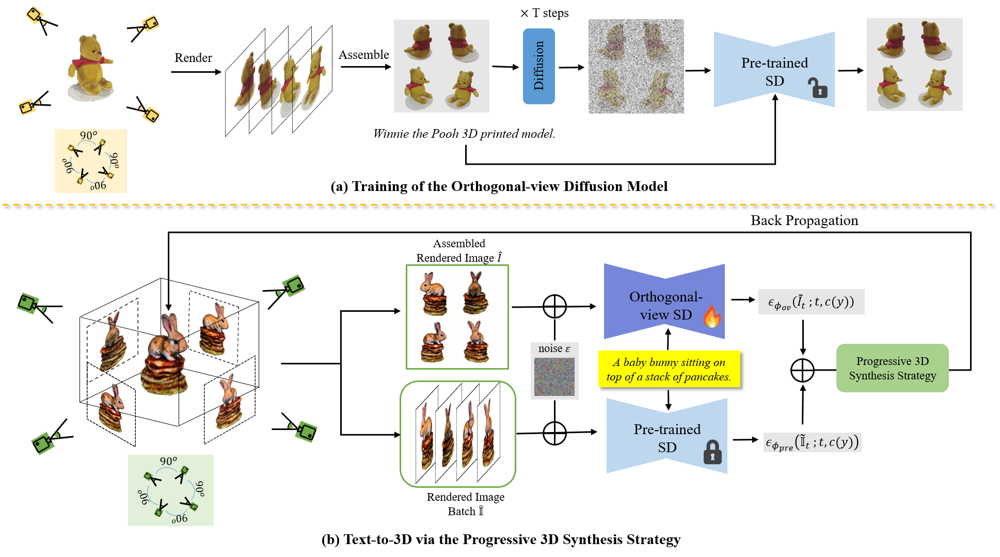

# EfficientDreamer
EfficientDreamer: High-Fidelity and Robust 3D Creation via Orthogonal-view Diffusion Prior

## [Project page](https://efficientdreamer.github.io) | [Paper](https://arxiv.org/abs/2308.13223)

While the image diffusion model has made significant strides in text-driven 3D content creation, it often falls short in accurately capturing the intended meaning of the text prompt, particularly with respect to direction information. This shortcoming gives rise to the Janus problem, where multi-faced 3D models are produced with the guidance of such diffusion models. In this paper, we present a robust pipeline for generating high-fidelity 3D content with orthogonal-view image guidance. Specifically, we introduce a novel 2D diffusion model that generates an image consisting of four orthogonal-view sub-images for the given text prompt. The 3D content is then created with this diffusion model, which enhances 3D consistency and provides strong structured semantic priors. This addresses the infamous Janus problem and significantly promotes generation efficiency. Additionally, we employ a progressive 3D synthesis strategy that results in substantial improvement in the quality of the created 3D contents. Both quantitative and qualitative evaluations show that our method demonstrates a significant improvement over previous text-to-3D techniques.

</a>

